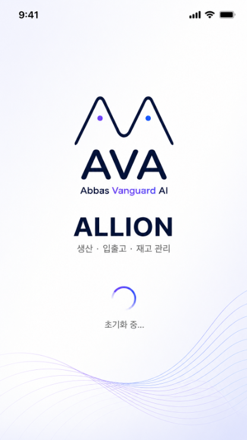
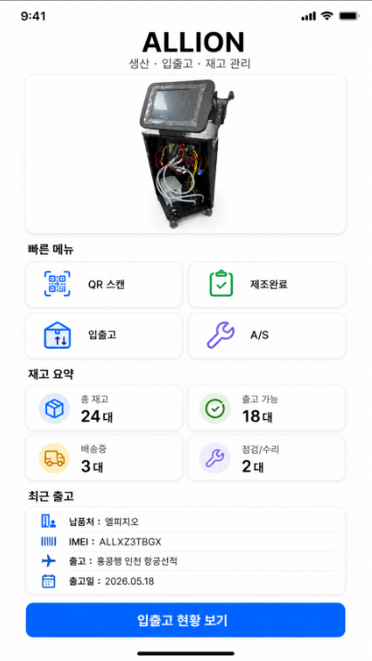
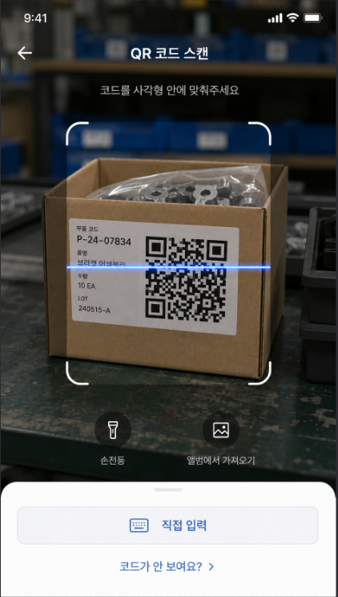
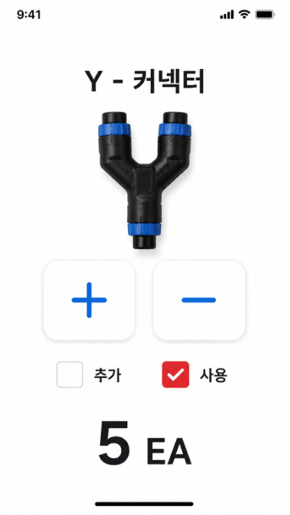
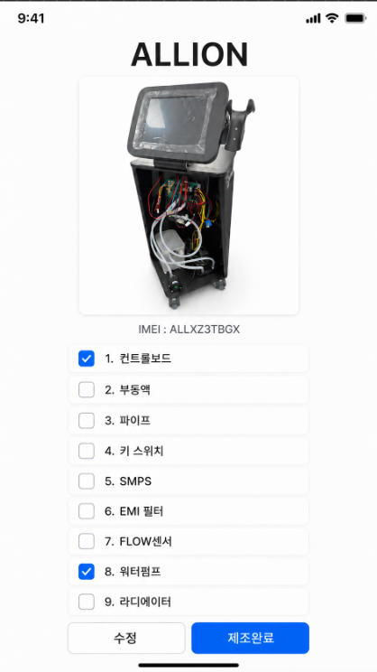
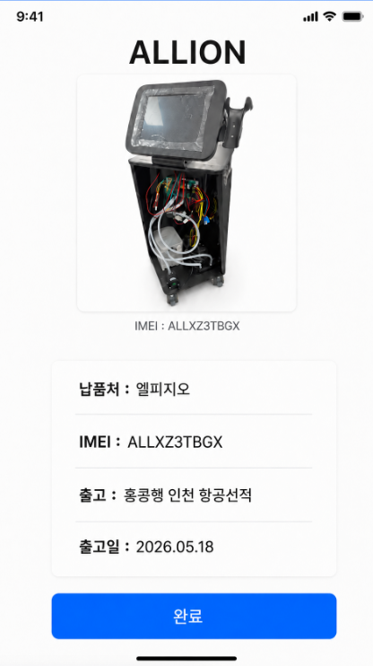
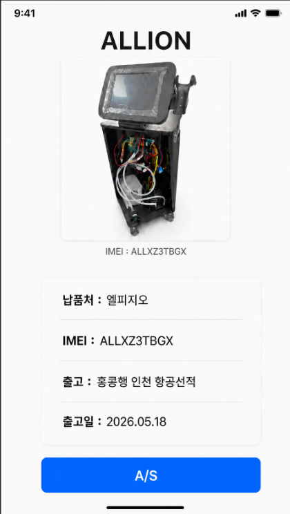
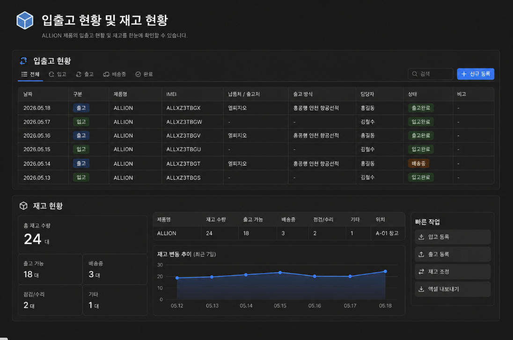
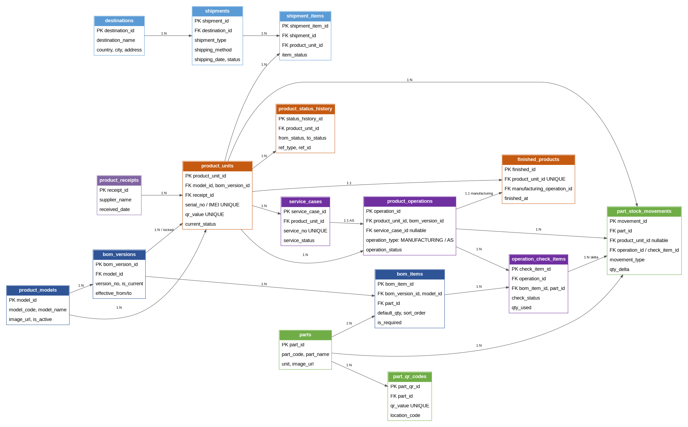

# AVA 湲곗〈 ????`AVA_stock` 紐⑤뱢 援ы쁽 紐낆꽭??
> ??臾몄꽌??Codex??洹몃?濡??꾨떖??援ы쁽???쒖옉?????덈룄濡??묒꽦??**A to Z 媛쒕컻 吏€?쒖꽌**?낅땲??
> 以묒슂???꾩젣: `AVA_stock`?€ 蹂꾨룄 ?좉퇋 ?깆씠 ?꾨땲?? **?대? 媛쒕컻?섏뼱 ?덈뒗 `AVA` ???덉뿉??硫붾돱瑜??뚮??????ㅽ뻾?섎뒗 Flutter 湲곕뒫 紐⑤뱢**?낅땲??
> 諛깆뿏?쒕뒗 **湲곗〈 Spring Boot ?쒕쾭??`AVA_stock` API 紐⑤뱢??異붽?**?섎뒗 諛⑹떇?쇰줈 援ы쁽?⑸땲??

---

## 0. 理쒖쥌 寃곕줎

- 湲곗〈 ???대쫫: **AVA**
- 異붽???硫붾돱/湲곕뒫 ?대쫫: **AVA_stock**
- UI: **湲곗〈 AVA Flutter ?꾨줈?앺듃 ?덉뿉 `ava_stock` feature/module濡?異붽?**
- 諛깆뿏?? **湲곗〈 AVA Spring Boot ?꾨줈?앺듃 ?덉뿉 `ava-stock` API 紐⑤뱢濡?異붽?**
- DB: 湲곗〈 AVA DB??`AVA_stock` ?꾩슜 ?뚯씠釉?留덉씠洹몃젅?댁뀡 異붽?
- `/stock`: ?꾩껜 ?낆텧怨?諛??ш퀬 ?꾪솴??蹂대뒗 ???€?쒕낫???섏씠吏€
- `ALLION`: ???대쫫???꾨땲??**?쒗뭹紐⑤뜽 ?덉떆**. ?ㅼ젣 ?쒗뭹?€ ?щ윭 媛쒖씪 ???덈떎.

??以??붿빟:

```text
AVA ????硫붾돱 ??AVA_stock 紐⑤뱢 吏꾩엯 ??QR 湲곕컲 諛섏젣???꾩젣??A/S/遺€?덉옱怨?異쒓퀬愿€由?```

---

## 1. Codex?먭쾶 ?꾨떖???듭떖 吏€??
Codex????臾몄꽌瑜?湲곗??쇰줈 ?꾨옒 ?먯튃??吏€耳?援ы쁽?쒕떎.

```text
1. ??Flutter ?깆쓣 留뚮뱾吏€ 留?寃?
2. 湲곗〈 AVA Flutter ???대???AVA_stock 硫붾돱?€ ?붾㈃??異붽???寃?
3. ??Spring Boot ?꾨줈?앺듃瑜?留뚮뱾吏€ 留?寃?
4. 湲곗〈 AVA Spring Boot 諛깆뿏???대???AVA_stock controller/service/repository/entity/migration??異붽???寃?
5. 湲곗〈 AVA ?깆쓽 ?쇱슦?? ?곹깭愿€由? API client, ?몄쬆 ?좏겙 泥섎━ 諛⑹떇??癒쇱? ?뺤씤?섍퀬 洹?諛⑹떇??洹몃?濡??곕? 寃?
6. ?쒗뭹紐?ALLION?€ ?깅챸???꾨땲???섑뵆 ?쒗뭹 紐⑤뜽紐낆쑝濡?泥섎━??寃?
7. 遺€??援ъ꽦?€ ?쒗뭹蹂꾨줈 ?ㅻⅤ誘€濡?BOM 湲곕컲?쇰줈 援ы쁽??寃?
8. 遺€???ъ슜?€ 遺€???붾㈃?먯꽌 ?섎룞?쇰줈 泥섎━?섏? 留먭퀬, 諛섏젣???쒖“ ?먮뒗 A/S 泥댄겕 ?€?????먮룞 李④컧??寃?
9. ?ш퀬 李④컧?€ 以묐났 李④컧?섏? ?딅룄濡?idempotent?섍쾶 泥섎━??寃?
10. ?꾨옒 UI ?덊띁?곗뒪?€ 理쒕????숈씪??紐⑤컮??UI 媛먯꽦?쇰줈 援ы쁽??寃?
```

---

## 2. ?꾩껜 ?꾪궎?띿쿂

```text
[AVA Flutter App]
  ?붴? 湲곗〈 硫붾돱
      ?붴? AVA_stock 硫붾돱 異붽?
          ?쒋? Splash/Loading
          ?쒋? Main Home
          ?쒋? QR Scan
          ?쒋? Part Quantity / Purchase
          ?쒋? Semi-product Checklist
          ?쒋? Finished Product Confirm
          ?쒋? Finished Product + A/S
          ?붴? Stock Dashboard Route ?먮뒗 WebView /stock

[AVA Spring Boot Backend]
  ?붴? AVA_stock module
      ?쒋? QR Lookup API
      ?쒋? Product API
      ?쒋? Manufacturing API
      ?쒋? A/S API
      ?쒋? Part Inventory API
      ?쒋? Shipment API
      ?붴? Stock Dashboard API

[PostgreSQL DB]
  ?쒋? product_models
  ?쒋? bom_versions
  ?쒋? bom_items
  ?쒋? parts
  ?쒋? part_qr_codes
  ?쒋? product_units
  ?쒋? product_operations
  ?쒋? operation_check_items
  ?쒋? part_stock_movements
  ?쒋? finished_products
  ?쒋? service_cases
  ?쒋? destinations
  ?쒋? shipments
  ?붴? shipment_items
```

---

## 3. 湲곗〈 AVA ?깆뿉 遺숈씠??諛⑹떇

### 3.1 Flutter 履??꾩튂

湲곗〈 Flutter ?꾨줈?앺듃 援ъ“瑜?癒쇱? ?뺤씤?쒕떎. 湲곗〈 ?꾨줈?앺듃媛€ `features` 湲곕컲?대㈃ ?꾨옒泥섎읆 異붽??쒕떎.

```text
lib/
  features/
    ava_stock/
      ava_stock_routes.dart
      data/
        api/
          ava_stock_api_client.dart
        dto/
          qr_lookup_response.dart
          product_detail_dto.dart
          checklist_dto.dart
          part_inventory_dto.dart
          stock_dashboard_dto.dart
        repositories/
          ava_stock_repository_impl.dart
      domain/
        models/
          product_unit.dart
          part.dart
          checklist_item.dart
          stock_summary.dart
        repositories/
          ava_stock_repository.dart
        usecases/
      presentation/
        pages/
          ava_stock_loading_page.dart
          ava_stock_home_page.dart
          qr_scan_page.dart
          part_quantity_page.dart
          semi_product_checklist_page.dart
          finished_confirm_page.dart
          finished_as_page.dart
          stock_dashboard_page.dart
        widgets/
          ava_stock_status_bar.dart
          product_image_card.dart
          quick_menu_card.dart
          stock_summary_card.dart
          checklist_row.dart
          primary_button.dart
          quantity_stepper.dart
```

湲곗〈 ?꾨줈?앺듃媛€ ??援ъ“媛€ ?꾨땲硫? **湲곗〈 ?꾨줈?앺듃??援ъ“瑜??곕Ⅴ??`ava_stock` 湲곕뒫 ?⑥쐞媛€ 遺꾨━?섎룄濡?異붽?**?쒕떎.

### 3.2 AVA 硫붿씤 硫붾돱??異붽?

湲곗〈 AVA ?깆쓽 硫붾돱 ?붾㈃ ?먮뒗 drawer/grid menu瑜?李얠븘???꾨옒 硫붾돱瑜?異붽??쒕떎.

```text
硫붾돱紐? AVA_stock
?ㅻ챸: ?앹궛 쨌 ?낆텧怨?쨌 ?ш퀬 愿€由??꾩씠肄? 諛뺤뒪/?먮툕/QR/?ш퀬 ?먮굦 ?꾩씠肄??대┃ ???대룞: AVA_stock Loading ?먮뒗 Home
```

?덉떆 ?쇱슦??

```dart
// 湲곗〈 ?쇱슦??諛⑹떇??留욎떠 ?섏젙?쒕떎.
const String avaStockEntryRoute = '/ava-stock';
const String avaStockHomeRoute = '/ava-stock/home';
const String avaStockQrScanRoute = '/ava-stock/qr-scan';
const String avaStockStockRoute = '/stock';
```

以묒슂:

```text
AVA ?깆쓽 ?꾩껜 ???대쫫, bundle id, package id瑜?AVA_stock?쇰줈 諛붽씀吏€ 留?寃?
AVA_stock?€ AVA ???대? 湲곕뒫紐낆씠??
```

---

## 4. Spring Boot 諛깆뿏?쒖뿉 遺숈씠??諛⑹떇

### 4.1 沅뚯옣 ?⑦궎吏€ 援ъ“

湲곗〈 Spring Boot ?꾨줈?앺듃??package convention??癒쇱? ?뺤씤?섍퀬, ?꾨옒 援ъ“瑜?湲곗〈 convention??留욎떠 異붽??쒕떎.

```text
src/main/java/{existing_root_package}/avastock/
  controller/
    AvaStockQrController.java
    AvaStockProductController.java
    AvaStockManufacturingController.java
    AvaStockServiceCaseController.java
    AvaStockPartController.java
    AvaStockShipmentController.java
    AvaStockDashboardController.java
  service/
    QrLookupService.java
    ProductQueryService.java
    ManufacturingService.java
    ServiceCaseService.java
    PartInventoryService.java
    ShipmentService.java
    StockDashboardService.java
  repository/
    ProductModelRepository.java
    BomVersionRepository.java
    BomItemRepository.java
    PartRepository.java
    PartQrCodeRepository.java
    ProductUnitRepository.java
    ProductOperationRepository.java
    OperationCheckItemRepository.java
    PartStockMovementRepository.java
    FinishedProductRepository.java
    ServiceCaseRepository.java
    ShipmentRepository.java
  entity/
    ProductModel.java
    BomVersion.java
    BomItem.java
    Part.java
    PartQrCode.java
    ProductUnit.java
    ProductOperation.java
    OperationCheckItem.java
    PartStockMovement.java
    FinishedProduct.java
    ServiceCase.java
    Destination.java
    Shipment.java
    ShipmentItem.java
  dto/
    QrLookupResponse.java
    ProductDetailResponse.java
    ChecklistResponse.java
    ChecklistSaveRequest.java
    PartPurchaseRequest.java
    ShipmentCreateRequest.java
    StockDashboardResponse.java
  enums/
    ProductStatus.java
    OperationType.java
    OperationStatus.java
    CheckStatus.java
    StockMovementType.java
    ShipmentStatus.java
```

### 4.2 API Prefix

紐⑤뱺 API??湲곗〈 ?몄쬆/沅뚰븳 誘몃뱾?⑥뼱瑜??듦낵?댁빞 ?쒕떎.

```text
/api/ava-stock/**
```

沅뚯옣 API:

```text
GET    /api/ava-stock/health
POST   /api/ava-stock/qr/lookup
GET    /api/ava-stock/home
GET    /api/ava-stock/products/{productUnitId}
GET    /api/ava-stock/products/by-qr/{qrValue}
GET    /api/ava-stock/products/{productUnitId}/manufacturing
POST   /api/ava-stock/products/{productUnitId}/manufacturing/save
POST   /api/ava-stock/products/{productUnitId}/manufacturing/complete
POST   /api/ava-stock/products/{productUnitId}/as/start
GET    /api/ava-stock/service-cases/{serviceCaseId}
POST   /api/ava-stock/service-cases/{serviceCaseId}/save
POST   /api/ava-stock/service-cases/{serviceCaseId}/complete
GET    /api/ava-stock/parts/{partId}
POST   /api/ava-stock/parts/{partId}/purchase
GET    /api/ava-stock/parts/{partId}/history
POST   /api/ava-stock/shipments
GET    /api/ava-stock/shipments
GET    /api/ava-stock/dashboard/stock
```

### 4.3 DB 留덉씠洹몃젅?댁뀡

湲곗〈 Spring Boot ?꾨줈?앺듃?먯꽌 Flyway ?먮뒗 Liquibase瑜??곌퀬 ?덈떎硫?湲곗〈 諛⑹떇 洹몃?濡?異붽??쒕떎.

Flyway ?덉떆:

```text
src/main/resources/db/migration/V20260518_001__create_ava_stock_tables.sql
```

Liquibase ?덉떆:

```text
src/main/resources/db/changelog/ava-stock/001-create-ava-stock-tables.xml
```

二쇱쓽:

```text
湲곗〈 AVA 諛깆뿏?쒖뿉 ?대? users ?뚯씠釉??먮뒗 account ?뚯씠釉붿씠 ?덉쓣 媛€?μ꽦???믩떎.
?꾩옱 ?ㅽ궎留덉쓽 users ?뚯씠釉붿? ?섑뵆/?낅┰ ?ㅽ뻾?⑹씠??
?ㅼ젣 ?듯빀 ?쒖뿉??created_by, checked_by, completed_by 而щ읆??湲곗〈 AVA ?ъ슜???뚯씠釉?PK?€ ?곌껐?섍굅??nullable濡??붾떎.
以묐났 users ?뚯씠釉붿쓣 留뚮뱾吏€ 留?寃?
```

沅뚯옣:

```text
湲곗〈 DB?€ 異⑸룎 媛€?μ꽦???덉쑝硫?PostgreSQL schema瑜?ava_stock?쇰줈 遺꾨━?쒕떎.
?? ava_stock.product_units, ava_stock.parts
```

---

## 5. UI ?덊띁?곗뒪

?꾨옒 ?대?吏€???ъ슜?먭? 吏곸젒 留뚮뱺 UI ?덊띁?곗뒪?? Flutter ?붾㈃?€ ???붿옄?몄쓣 湲곗??쇰줈 理쒕????숈씪?섍쾶 援ы쁽?쒕떎.

### 5.1 AVA_stock 吏꾩엯 濡쒕뵫 ?섏씠吏€



?⑸룄:

```text
AVA ?깆뿉??AVA_stock 硫붾돱瑜??꾨Ⅸ 吏곹썑 ?쒖떆?섎뒗 紐⑤뱢 濡쒕뵫 ?섏씠吏€.
湲곗〈 AVA ???꾩껜 ?ㅽ뵆?섏떆媛€ ?꾨땲??
```

援ы쁽 ?붽뎄:

- 以묒븰 AVA 濡쒓퀬
- `Abbas Vanguard AI`
- `AVA_stock` ?먮뒗 `AVA_stock` 湲곕뒫紐??쒖떆
- `?앹궛 쨌 ?낆텧怨?쨌 ?ш퀬 愿€由?
- 濡쒕뵫 ?ㅽ뵾??- `珥덇린??以?..`
- ?섎떒 ?⑥씠釉?洹몃옒??- health check ?먮뒗 湲곕낯 ?곗씠??濡쒕뵫 ??硫붿씤 ?섏씠吏€ ?대룞

---

### 5.2 AVA_stock 硫붿씤 ?섏씠吏€



援ы쁽 ?붽뎄:

- ?곷떒 ?€?댄?: `AVA_stock`
- ?쒕툕?띿뒪?? `?앹궛 쨌 ?낆텧怨?쨌 ?ш퀬 愿€由?
- ?쒗뭹 ?€???대?吏€ 移대뱶
- 鍮좊Ⅸ 硫붾돱 4媛?  - QR ?ㅼ틪
  - ?쒖“?꾨즺
  - ?낆텧怨?  - A/S
- ?ш퀬 ?붿빟
  - 珥??ш퀬
  - 異쒓퀬 媛€??  - 諛곗넚以?  - ?먭?/?섎━
- 理쒓렐 異쒓퀬 ?뺣낫
  - ?⑺뭹泥?  - IMEI
  - 異쒓퀬
  - 異쒓퀬??- ?섎떒 踰꾪듉: `?낆텧怨??꾪솴 蹂닿린`
- 踰꾪듉 ?대┃ ??`/stock` ?붾㈃?쇰줈 ?대룞

---

### 5.3 QR ?ㅼ틪 ?섏씠吏€



援ы쁽 ?붽뎄:

- ?ㅼ젣 移대찓???꾨━酉?- ?대몢???ㅻ쾭?덉씠
- ?곷떒 ?ㅻ줈媛€湲?- ?€?댄? `QR 肄붾뱶 ?ㅼ틪`
- ?덈궡臾멸뎄 `肄붾뱶瑜??ш컖???덉뿉 留욎떠二쇱꽭??
- ?곗깋 ?κ렐 ?ㅼ틪 ?꾨젅??- ?뚮? ?ㅼ틪 ?쇱씤
- ?섎떒 ?먯쟾?? ?⑤쾾 媛€?몄삤湲?- 諛뷀??쒗듃: 吏곸젒 ?낅젰, 肄붾뱶媛€ ??蹂댁뿬??

QR 泥섎━:

```text
?ㅼ틪 ?깃났
??POST /api/ava-stock/qr/lookup
??qr_type怨?current_status???곕씪 ?섏씠吏€ 遺꾧린
```

遺꾧린:

```text
PART
??遺€???섎웾/異붽?留ㅼ엯 ?섏씠吏€

PRODUCT + SEMI_RECEIVED/MFG_SAVED
??諛섏젣???ъ슜 遺€??泥댄겕 ?섏씠吏€

PRODUCT + FINISHED_READY/SHIPPING/SHIPPED/AS_READY
???꾩젣??諛?A/S ?섏씠吏€

PRODUCT + AS_IN_PROGRESS
??吏꾪뻾以묒씤 A/S 泥댄겕 ?섏씠吏€
```

---

### 5.4 遺€??QR ?ㅼ틪 ??遺€???섎웾 ?섏씠吏€



?덊띁?곗뒪 ?ㅻ챸:

```text
遺€??QR??李띿? ???섏삤??遺€???섎웾 ?섏씠吏€.
```

理쒖쥌 ?뺤콉:

```text
遺€?뉲B ?붾㈃?먯꽌???쇰컲 ?묒뾽?먯슜 '?ъ슜' 湲곕뒫???쒓났?섏? ?딅뒗??
遺€???ъ슜?€ 諛섏젣???쒖“ 泥댄겕 ?먮뒗 A/S 泥댄겕 ?€?????먮룞?쇰줈 諛쒖깮?쒕떎.
```

?곕씪??Flutter 援ы쁽 ??

- ?곷떒 遺€?덈챸 ?쒖떆. ?? `Y - 而ㅻ꽖??
- 遺€???대?吏€ ?쒖떆
- `+`, `-` ?섎웾 議곗젅
- ?섎웾 ?띿뒪?? ?? `5 EA`
- 湲곕낯 紐⑤뱶??`異붽?留ㅼ엯`
- ?€??踰꾪듉 ?? `?낃퀬 ?€??
- `?ш퀬 ?대젰 蹂닿린` 踰꾪듉 ?쒓났 媛€??- ?덊띁?곗뒪 ?대?吏€??`?ъ슜` 泥댄겕???쇰컲 ?ъ슜??紐⑤뱶?먯꽌???쒓굅?섍굅??鍮꾪솢?깊솕?쒕떎.
- 愿€由ъ옄 紐⑤뱶?먯꽌留?`湲고? 李④컧`, `?먭린`, `?ㅼ궗 議곗젙` 媛€??
DB ?숈옉:

```text
異붽?留ㅼ엯
??part_stock_movements INSERT
   movement_type = PURCHASE_IN
   qty_delta = +?섎웾
```

---

### 5.5 諛섏젣??QR ?ㅼ틪 ???ъ슜 遺€??泥댄겕 ?섏씠吏€



?덊띁?곗뒪 ?ㅻ챸:

```text
諛섏젣??QR??李띿? ???섏삤??諛섏젣???ъ슜 遺€??泥댄겕 ?섏씠吏€.
```

援ы쁽 ?붽뎄:

- ?곷떒 ?€?댄??€ QR濡?議고쉶???쒗뭹紐? ?? `ALLION`
- ?쒗뭹 ?대?吏€
- `IMEI : ALLXZ3TBGX`
- ?쒗뭹蹂?BOM 湲곗? 泥댄겕由ъ뒪??- 泥댄겕??遺€?덉? ?뚮? 泥댄겕諛뺤뒪
- ?섎떒 踰꾪듉
  - `?섏젙`
  - `?쒖“?꾨즺`

湲곕뒫:

```text
?€???섏젙
??泥댄겕??遺€?덉? USED
??泥댄겕?섏? ?딆? 遺€?덉? PENDING
???쒗뭹 ?곹깭 MFG_SAVED
??泥댄겕??遺€?덈쭔 PRODUCTION_USE濡??ш퀬 李④컧

?쒖“?꾨즺
??泥댄겕??遺€?덉? USED
??泥댄겕?섏? ?딆? 遺€?덉? NOT_USED
??finished_products ?앹꽦
???쒗뭹 ?곹깭 FINISHED_READY
```

---

### 5.6 ?쒖“?꾨즺 ???꾩젣???뺤씤 ?섏씠吏€



?덊띁?곗뒪 ?ㅻ챸:

```text
諛섏젣???ъ슜 遺€??泥댄겕 ?섏씠吏€?먯꽌 '?쒖“?꾨즺'瑜??꾨Ⅸ ???섏삤???꾩젣???뺤씤 ?섏씠吏€.
```

援ы쁽 ?붽뎄:

- ?쒗뭹紐? ?? `ALLION`
- ?쒗뭹 ?대?吏€
- IMEI
- ?⑺뭹泥?- 異쒓퀬 ?뺣낫
- 異쒓퀬??- ?섎떒 踰꾪듉: `?꾨즺`

???붾㈃?€ ?쒖“?꾨즺 ??異쒓퀬 ?뺣낫 ?뺤씤 ?먮뒗 異쒓퀬 ?깅줉 ???뺤씤 ?붾㈃?쇰줈 ?ъ슜?쒕떎.

---

### 5.7 ?꾩젣??QR ?ㅼ틪 ???꾩젣??諛?A/S ?섏씠吏€



?덊띁?곗뒪 ?ㅻ챸:

```text
?꾩젣???뺤씤 ???꾩젣?덉쓽 QR???ㅼ떆 李띿뿀?????섏삤???꾩젣??諛?A/S ?섏씠吏€.
```

援ы쁽 ?붽뎄:

- ?쒗뭹紐?- ?쒗뭹 ?대?吏€
- IMEI
- ?⑺뭹泥?- 異쒓퀬 諛⑹떇
- 異쒓퀬??- ?섎떒 踰꾪듉: `A/S`

A/S 踰꾪듉 ?숈옉:

```text
POST /api/ava-stock/products/{productUnitId}/as/start
??service_cases ?앹꽦
??product_operations ?앹꽦(operation_type=AS)
???쒗뭹 ?곹깭 AS_IN_PROGRESS
??A/S 泥댄겕 ?섏씠吏€濡??대룞
```

A/S 泥댄겕 ?섏씠吏€??諛섏젣??泥댄겕 ?섏씠吏€?€ 媛숈? UI 而댄룷?뚰듃瑜??ъ궗?⑺븯???묒뾽 ?€?낅쭔 `AS`濡??ㅼ젙?쒕떎.

---

### 5.8 紐⑤뱺 ?댁뿭???섏삤?????섏씠吏€ `/stock`



?덊띁?곗뒪 ?ㅻ챸:

```text
紐⑤뱺 ?댁뿭???섏삤?????섏씠吏€. route??/stock.
```

援ы쁽 諛⑹떇:

- 湲곗〈 AVA媛€ Flutter Web???ъ슜?쒕떎硫?Flutter route `/stock`?쇰줈 援ы쁽?쒕떎.
- 湲곗〈 AVA媛€ 紐⑤컮?쇰쭔 ?덇퀬 蹂꾨룄 ?뱀씠 ?녿떎硫?Spring Boot媛€ ?뺤쟻 Flutter Web build瑜??쒕튃?섍굅?? 湲곗〈 愿€由ъ옄 ???꾨줎?몄뿉 `/stock` ?섏씠吏€瑜?異붽??쒕떎.
- 諛깆뿏?쒕뒗 ?숈씪?섍쾶 `/api/ava-stock/dashboard/stock`???쒓났?쒕떎.

?붾㈃ ?붿냼:

- ?쒕ぉ: `?낆텧怨??꾪솴 諛??ш퀬 ?꾪솴`
- ?낆텧怨??꾪솴 ?뚯씠釉?  - ?좎쭨
  - 援щ텇
  - ?쒗뭹紐?  - IMEI
  - ?⑺뭹泥?/ 異쒓퀬泥?  - 異쒓퀬 諛⑹떇
  - ?대떦??  - ?곹깭
  - 鍮꾧퀬
- ?ш퀬 ?꾪솴
  - 珥??ш퀬 ?섎웾
  - 異쒓퀬 媛€??  - 諛곗넚以?  - ?먭?/?섎━
- ?쒗뭹蹂??ш퀬 ?뚯씠釉?- 理쒓렐 7???ш퀬 蹂€??李⑦듃
- 鍮좊Ⅸ ?묒뾽
  - ?낃퀬 ?깅줉
  - 異쒓퀬 ?깅줉
  - ?ш퀬 議곗젙
  - ?묒? ?대낫?닿린

---

## 6. DB 援ъ“ ?붿빟

理쒖쥌 DB???ㅼ쓬 媛쒕뀗?쇰줈 援ъ꽦?쒕떎.

```text
?쒗뭹紐⑤뜽
  ?붴? BOM 踰꾩쟾
      ?붴? ?쒗뭹蹂?遺€??泥댄겕由ъ뒪??
?ㅼ젣 ?쒗뭹 QR
  ?쒋? 諛섏젣???쒖“ ?묒뾽
  ?쒋? ?꾩젣???꾪솚
  ?쒋? 異쒓퀬 ?대젰
  ?붴? A/S ?묒뾽 ?대젰

遺€??  ?쒋? 遺€?덈컯??QR
  ?쒋? ?꾩옱 ?ш퀬 議고쉶
  ?붴? 遺€???ш퀬 利앷컧 ?먯옣
```

?듭떖 ?뚯씠釉?

| ?곸뿭 | ?뚯씠釉?|
|---|---|
| ?쒗뭹 醫낅쪟 | `product_models` |
| ?쒗뭹蹂?BOM 踰꾩쟾 | `bom_versions` |
| ?쒗뭹蹂?遺€??泥댄겕由ъ뒪??| `bom_items` |
| 遺€??留덉뒪??| `parts` |
| 遺€?덈컯??QR | `part_qr_codes` |
| 諛섏젣???낃퀬 | `product_receipts` |
| ?ㅼ젣 ?쒗뭹 QR | `product_units` |
| ?쒗뭹 ?곹깭 ?대젰 | `product_status_history` |
| ?쒖“/A/S ?묒뾽 | `product_operations` |
| ?쒖“/A/S 泥댄겕諛뺤뒪 | `operation_check_items` |
| 遺€???ш퀬 ?대젰 | `part_stock_movements` |
| ?꾩젣??湲곕줉 | `finished_products` |
| A/S ?묒닔 | `service_cases` |
| ?⑺뭹泥?| `destinations` |
| 異쒓퀬 | `shipments` |
| 異쒓퀬 ?쒗뭹 紐⑸줉 | `shipment_items` |

ERD:



---

## 7. DB 愿€怨??ㅻ챸

### 7.1 ?쒗뭹蹂?遺€??援ъ꽦???ㅻⅨ ?댁쑀

?쒗뭹???섎굹媛€ ?꾨땲誘€濡?`parts`留뚯쑝濡?泥댄겕由ъ뒪?몃? 留뚮뱾硫????쒕떎.

```text
product_models
?쒗뭹 醫낅쪟: ALLION, ?쒗뭹B, ?쒗뭹C ...

bom_versions
?쒗뭹蹂?BOM 踰꾩쟾: ALLION v1, ALLION v2, ?쒗뭹B v1 ...

bom_items
?대떦 BOM???ы븿?섎뒗 遺€??紐⑸줉
```

?덉떆:

```text
ALLION v1 BOM
- 遺€?뉯
- 遺€?뉰
- 遺€?뉱

?쒗뭹B v1 BOM
- 遺€?뉻
- 遺€?뉽
- 遺€?뉾
```

?쒗뭹 QR??李띿쑝硫??대떦 `product_units.bom_version_id` 湲곗??쇰줈 泥댄겕由ъ뒪?멸? ?섏삩??

### 7.2 ?ㅼ젣 ?쒗뭹 異붿쟻

`product_units`??QR??遺숈? ?ㅼ젣 ?쒗뭹 1?€瑜??섎??쒕떎.

```text
product_units
- product_unit_id
- model_id
- bom_version_id
- serial_no / IMEI
- qr_value
- current_status
```

?섎굹???쒗뭹 QR?€ ?앹븷二쇨린 ?대궡 ?좎??쒕떎.

```text
諛섏젣??QR = ?꾩젣??QR = A/S 議고쉶 QR
```

### 7.3 ?쒖“?€ A/S

?쒖“?€ A/S??紐⑤몢 `product_operations`???€?ν븳??

```text
operation_type = MANUFACTURING
operation_type = AS
```

媛??묒뾽??泥댄겕諛뺤뒪 ?곹깭??`operation_check_items`???€?ν븳??

```text
PENDING  : ?꾩쭅 ?먮떒 ????USED     : ?ㅼ젣 ?ъ슜??NOT_USED : ?대쾲 ?쒗뭹?먮뒗 ?ъ슜?섏? ?딆쓬
```

### 7.4 遺€???ш퀬

遺€???ш퀬???먯옣?€ `part_stock_movements`??

```text
PURCHASE_IN     異붽?留ㅼ엯
PRODUCTION_USE  ?쒖“ ?ъ슜
AS_USE          A/S 援먯껜 ?ъ슜
ADJUSTMENT_IN   愿€由ъ옄 利앷? 議곗젙
ADJUSTMENT_OUT  愿€由ъ옄 媛먯냼 議곗젙
REVERSAL        痍⑥냼 / ?섎룎由?```

?꾩옱 ?ш퀬??`part_stock_movements.qty_delta` ?⑹궛?쇰줈 怨꾩궛?쒕떎.

---

## 8. ?곹깭媛?
### 8.1 ?쒗뭹 ?곹깭

```text
SEMI_RECEIVED    諛섏젣???낃퀬
MFG_SAVED        諛섏젣???쒖“ 泥댄겕 ?€?λ맖
FINISHED_READY   ?쒖“?꾨즺, 異쒓퀬媛€??SHIPPING         諛곗넚以?SHIPPED          異쒓퀬?꾨즺
AS_IN_PROGRESS   A/S / ?먭? / ?섎━以?AS_READY         A/S ?꾨즺, ?ㅼ떆 異쒓퀬媛€??HOLD             蹂대쪟
SCRAPPED         ?먭린
```

?€?쒕낫??怨꾩궛:

```text
諛섏젣???ш퀬 = SEMI_RECEIVED + MFG_SAVED
A/S以??쒗뭹 = AS_IN_PROGRESS
諛섏젣??+ A/S以??ш퀬 = SEMI_RECEIVED + MFG_SAVED + AS_IN_PROGRESS
異쒓퀬媛€??= FINISHED_READY + AS_READY
諛곗넚以?= SHIPPING
?먭?/?섎━以?= AS_IN_PROGRESS
```

### 8.2 ?묒뾽 ?곹깭

```text
DRAFT
SAVED
COMPLETED
CANCELLED
```

### 8.3 泥댄겕 ?곹깭

```text
PENDING
USED
NOT_USED
```

---

## 9. API ?곸꽭

### 9.1 QR Lookup

```http
POST /api/ava-stock/qr/lookup
```

Request:

```json
{
  "qrValue": "QR-ALLXZ3TBGX"
}
```

Response ?덉떆:

```json
{
  "qrType": "PRODUCT",
  "productUnitId": 1,
  "modelCode": "ALLION",
  "modelName": "ALLION",
  "serialNo": "ALLXZ3TBGX",
  "currentStatus": "SEMI_RECEIVED",
  "nextScreen": "MANUFACTURING_CHECKLIST"
}
```

PART ?덉떆:

```json
{
  "qrType": "PART",
  "partId": 10,
  "partCode": "ALLION-Y-CONNECTOR",
  "partName": "Y - 而ㅻ꽖??,
  "nextScreen": "PART_PURCHASE"
}
```

### 9.2 諛섏젣??泥댄겕由ъ뒪??議고쉶

```http
GET /api/ava-stock/products/{productUnitId}/manufacturing
```

Response:

```json
{
  "productUnitId": 1,
  "modelName": "ALLION",
  "serialNo": "ALLXZ3TBGX",
  "imageUrl": "...",
  "status": "MFG_SAVED",
  "progress": {
    "totalCheckItems": 9,
    "usedItems": 2,
    "pendingItems": 7,
    "usedPartPct": 22.2,
    "decisionProgressPct": 22.2
  },
  "items": [
    {
      "bomItemId": 1,
      "partId": 1,
      "displayPartName": "而⑦듃濡ㅻ낫??,
      "checkStatus": "USED",
      "qtyUsed": 1
    }
  ]
}
```

### 9.3 諛섏젣???€??
```http
POST /api/ava-stock/products/{productUnitId}/manufacturing/save
```

Request:

```json
{
  "items": [
    { "bomItemId": 1, "checkStatus": "USED", "qtyUsed": 1 },
    { "bomItemId": 2, "checkStatus": "PENDING", "qtyUsed": 0 }
  ]
}
```

泥섎━:

```text
1. MANUFACTURING operation ?앹꽦 ?먮뒗 議고쉶
2. operation_check_items upsert
3. USED ?섎웾 蹂€寃쎈텇留?part_stock_movements??PRODUCTION_USE ?먮뒗 REVERSAL 湲곕줉
4. product_units.current_status = MFG_SAVED
```

### 9.4 ?쒖“?꾨즺

```http
POST /api/ava-stock/products/{productUnitId}/manufacturing/complete
```

泥섎━:

```text
1. 泥댄겕??遺€?덉? USED
2. 泥댄겕?섏? ?딆? 遺€?덉? NOT_USED
3. ?꾩슂???ш퀬 李④컧 delta 湲곕줉
4. product_operations.operation_status = COMPLETED
5. finished_products ?앹꽦
6. product_units.current_status = FINISHED_READY
7. product_status_history 湲곕줉
```

### 9.5 A/S ?쒖옉

```http
POST /api/ava-stock/products/{productUnitId}/as/start
```

泥섎━:

```text
1. service_cases ?앹꽦
2. product_operations ?앹꽦(operation_type = AS)
3. product_units.current_status = AS_IN_PROGRESS
4. A/S 泥댄겕由ъ뒪???붾㈃?쇰줈 ?대룞
```

### 9.6 A/S ?€???꾨즺

```http
POST /api/ava-stock/service-cases/{serviceCaseId}/save
POST /api/ava-stock/service-cases/{serviceCaseId}/complete
```

A/S ?€?μ? ?쒖“ ?€?κ낵 ?숈씪?섎릺 `movement_type = AS_USE`瑜??ъ슜?쒕떎.

A/S ?꾨즺 ??

```text
service_cases.service_status = COMPLETED
product_operations.operation_status = COMPLETED
product_units.current_status = AS_READY
```

### 9.7 遺€??異붽?留ㅼ엯

```http
POST /api/ava-stock/parts/{partId}/purchase
```

Request:

```json
{
  "partQrId": 1,
  "quantity": 5,
  "memo": "遺€??異붽?留ㅼ엯"
}
```

泥섎━:

```text
part_stock_movements INSERT
movement_type = PURCHASE_IN
qty_delta = +5
```

### 9.8 ?€?쒕낫??
```http
GET /api/ava-stock/dashboard/stock
```

Response??`/stock` ?붾㈃????踰덉뿉 洹몃┫ ???덇쾶 援ъ꽦?쒕떎.

```json
{
  "summary": {
    "totalStockQty": 24,
    "shippableQty": 18,
    "shippingQty": 3,
    "inspectionRepairQty": 2
  },
  "recentShipments": [],
  "inventoryByModel": [],
  "stockTrend": []
}
```

---

## 10. 諛깆뿏???듭떖 鍮꾩쫰?덉뒪 濡쒖쭅

### 10.1 以묐났 ?ш퀬 李④컧 諛⑹?

泥댄겕諛뺤뒪 ?€?μ쓣 ?щ윭 踰??뚮윭???ш퀬媛€ 以묐났 李④컧?섎㈃ ???쒕떎.

?€??濡쒖쭅?€ 諛섎뱶???꾨옒 諛⑹떇?쇰줈 援ы쁽?쒕떎.

```text
紐⑺몴 ?ъ슜 ?섎웾 - ?대? ?ш퀬??諛섏쁺???섎웾 = 異붽?濡?諛섏쁺???섎웾
```

?덉떆:

```text
紐⑺몴 ?ъ슜?? 1
?대? 李④컧???섎웾: 1
異붽? 李④컧: 0

紐⑺몴 ?ъ슜?? 2
?대? 李④컧???섎웾: 1
異붽? 李④컧: -1 movement 異붽?

紐⑺몴 ?ъ슜?? 0
?대? 李④컧???섎웾: 1
REVERSAL +1 movement 異붽?
```

?댁쁺 ?먯튃:

```text
湲곗〈 part_stock_movements瑜???젣?섏? 留?寃?
痍⑥냼/媛먯냼??REVERSAL濡?湲곕줉??寃?
```

### 10.2 遺€???붾㈃?먯꽌 ?ъ슜 泥섎━ 湲덉?

?쇰컲 ?묒뾽?먮뒗 遺€??QR ?섏씠吏€?먯꽌 `?ъ슜`???꾨Ⅴ吏€ ?딅뒗??

```text
遺€??異붽? = 遺€??QR ?섏씠吏€?먯꽌 PURCHASE_IN
遺€???ъ슜 = 諛섏젣???쒖“ ?먮뒗 A/S 泥댄겕 ?€?μ뿉???먮룞 諛쒖깮
```

### 10.3 BOM 踰꾩쟾 怨좎젙

?쒗뭹 ?낃퀬 ?쒖젏??`product_units.bom_version_id`瑜?諛섎뱶???€?ν븳??

```text
?섏쨷??ALLION v2媛€ ?앷꺼??湲곗〈 ALLION v1 ?쒗뭹??泥댄겕由ъ뒪?몄? 吏꾪뻾瑜좎? 蹂€?섎㈃ ???쒕떎.
```

### 10.4 ?쒗뭹 QR ?좎?

?쒗뭹 QR?€ 諛섏젣?덉뿉???꾩젣?? 異쒓퀬, A/S源뚯? ?숈씪?섍쾶 ?좎??쒕떎.

```text
諛섏젣??QR = ?꾩젣??QR = A/S QR
```

---

## 11. Flutter 援ы쁽 ?몃??ы빆

### 11.1 ?붿옄???좏겙

?덊띁?곗뒪 UI??怨듯넻 ?먮굦:

```text
諛곌꼍: #FFFFFF ?먮뒗 ?꾩＜ ?낆? 洹몃젅??二쇱슂 ?뚮옉: #006CFF 怨꾩뿴
蹂댁“ 蹂대씪: #7B61FF 怨꾩뿴
?띿뒪?? #111111
蹂댁“ ?띿뒪?? #666666
移대뱶: ?곗깋, border radius 16~24, 誘몄꽭??shadow
踰꾪듉: ?뚮???solid CTA, border radius 12~16
```

### 11.2 怨듯넻 ?꾩젽

```text
AvaStockPageScaffold
AvaStockHeader
ProductImageCard
QuickMenuTile
StockSummaryTile
ChecklistRow
QuantityStepper
PrimaryActionButton
SecondaryActionButton
```

### 11.3 QR ?ㅼ틪

- 湲곗〈 AVA ?깆뿉???대? ?ъ슜?섎뒗 QR/camera ?⑦궎吏€媛€ ?덉쑝硫?洹몃?濡??ъ슜?쒕떎.
- ?녿떎硫?Flutter QR scanner ?⑦궎吏€瑜?異붽??섎릺 湲곗〈 ?꾨줈?앺듃 dependency ?뺤콉??留욎텣??
- QR ?ㅼ틪 以묐났 ?몄텧 諛⑹?瑜??꾪빐 scan lock???붾떎.

```dart
bool _isProcessingScan = false;

Future<void> onQrDetected(String qrValue) async {
  if (_isProcessingScan) return;
  _isProcessingScan = true;
  try {
    final result = await repository.lookupQr(qrValue);
    navigateByQrResult(result);
  } finally {
    _isProcessingScan = false;
  }
}
```

### 11.4 ?ㅻ퉬寃뚯씠??遺꾧린

```dart
void navigateByQrResult(QrLookupResponse result) {
  switch (result.nextScreen) {
    case 'PART_PURCHASE':
      // PartQuantityPage
      break;
    case 'MANUFACTURING_CHECKLIST':
      // SemiProductChecklistPage
      break;
    case 'FINISHED_DETAIL':
      // FinishedAsPage
      break;
    case 'AS_CHECKLIST':
      // AS checklist page
      break;
  }
}
```

---

## 12. `/stock` ???섏씠吏€ 援ы쁽

媛€?ν븳 援ы쁽 諛⑹떇:

```text
1. 湲곗〈 AVA媛€ Flutter Web???댁쁺 以묒씠硫?Flutter route /stock?쇰줈 援ы쁽
2. 湲곗〈 AVA ?깆뿉???밸럭濡?愿€由ъ옄 ?섏씠吏€瑜??щ뒗 援ъ“?쇰㈃ /stock URL??WebView濡??ㅽ뵂
3. Spring Boot??UI瑜?吏곸젒 留뚮뱾吏€ ?딄퀬 API留??쒓났?섎뒗 寃껋쓣 ?곗꽑 沅뚯옣
```

`/stock` ?붾㈃?€ ?대몢???€?쒕낫???ㅽ??쇱씠硫? ?덊띁?곗뒪 ?대?吏€瑜??곕Ⅸ??

?꾩슂 ?곗씠??

```text
GET /api/ava-stock/dashboard/stock
GET /api/ava-stock/shipments
GET /api/ava-stock/parts/{partId}/history
```

---

## 13. ?뚯뒪???쒕굹由ъ삤

### 13.1 諛섏젣???쒖“

```text
1. ?쒗뭹紐⑤뜽 ALLION ?깅줉
2. ALLION BOM??遺€??10媛??깅줉
3. 諛섏젣??product_units ?앹꽦
4. QR lookup
5. ?쒖“ 泥댄겕由ъ뒪??議고쉶
6. 遺€??2媛?USED ?€??7. part_stock_movements??PRODUCTION_USE -2 ?앹꽦 ?뺤씤
8. 吏꾪뻾瑜??뺤씤
9. ?쒖“?꾨즺
10. finished_products ?앹꽦 ?뺤씤
11. current_status FINISHED_READY ?뺤씤
```

### 13.2 A/S

```text
1. ?꾩젣??QR lookup
2. A/S ?쒖옉
3. service_cases ?앹꽦 ?뺤씤
4. A/S 泥댄겕由ъ뒪?몄뿉??遺€??1媛?USED ?€??5. part_stock_movements??AS_USE -1 ?앹꽦 ?뺤씤
6. A/S ?꾨즺
7. current_status AS_READY ?뺤씤
8. ?쒗뭹 珥??ъ슜 遺€??議고쉶 ???쒖“ ?ъ슜??+ A/S ?ъ슜???⑹궛 ?뺤씤
```

### 13.3 遺€??異붽?留ㅼ엯

```text
1. 遺€??QR lookup
2. 異붽?留ㅼ엯 5媛??€??3. PURCHASE_IN +5 ?앹꽦 ?뺤씤
4. ?꾩옱 ?ш퀬 利앷? ?뺤씤
```

### 13.4 異쒓퀬

```text
1. FINISHED_READY ?먮뒗 AS_READY ?쒗뭹 ?좏깮
2. 異쒓퀬泥? 異쒓퀬諛⑸쾿, 異쒓퀬???낅젰
3. shipments ?앹꽦
4. shipment_items ?곌껐
5. product_units.current_status SHIPPING 蹂€寃?6. /stock?먯꽌 諛곗넚以??섎웾 利앷? ?뺤씤
```

---

## 14. Codex ?묒뾽 ?쒖꽌

Codex???꾨옒 ?쒖꽌?€濡?援ы쁽?쒕떎.

```text
1. 湲곗〈 AVA Flutter ?꾨줈?앺듃 援ъ“ ?뺤씤
2. 湲곗〈 AVA Spring Boot ?꾨줈?앺듃 援ъ“ ?뺤씤
3. 湲곗〈 ?몄쬆/?ъ슜??沅뚰븳/DB 留덉씠洹몃젅?댁뀡 諛⑹떇 ?뺤씤
4. DB migration 異붽?
5. Spring Boot entity/repository/service/controller 異붽?
6. API ?뚯뒪???묒꽦
7. Flutter data layer 異붽?
8. Flutter AVA_stock route 異붽?
9. 湲곗〈 AVA 硫붾돱??AVA_stock 硫붾돱 異붽?
10. UI ?덊띁?곗뒪 湲곕컲 ?붾㈃ 援ы쁽
11. QR lookup 遺꾧린 援ы쁽
12. ?쒖“/A/S ?€??濡쒖쭅 ?곌껐
13. /stock ?붾㈃ 援ы쁽
14. ?꾩껜 ?쒕굹由ъ삤 ?뚯뒪??```

---

## 15. 援ы쁽 ?꾨즺 湲곗?

?꾨즺 湲곗??€ ?꾨옒?€ 媛숇떎.

```text
AVA ??硫붾돱?먯꽌 AVA_stock 吏꾩엯 媛€??AVA_stock 濡쒕뵫 ?섏씠吏€ ?쒖떆
硫붿씤 ?섏씠吏€ ?쒖떆
QR ?ㅼ틪 媛€??遺€??QR ??異붽?留ㅼ엯 ?섏씠吏€ ?대룞
諛섏젣??QR ???쒗뭹蹂?BOM 泥댄겕由ъ뒪???쒖떆
泥댄겕 ?€????遺€???ш퀬 ?먮룞 李④컧
?쒖“?꾨즺 ???꾩젣???꾪솚
?꾩젣??QR ??異쒓퀬/A/S ?뺣낫 ?쒖떆
A/S ?쒖옉/?€???꾨즺 媛€??A/S ?ъ슜 遺€?덉씠 ?쒖“ ?ъ슜 遺€?덇낵 蹂꾨룄濡??꾩쟻??/stock ?섏씠吏€?먯꽌 ?낆텧怨?諛??ш퀬 ?꾪솴 議고쉶 媛€???쒗뭹???щ윭 媛쒖뿬???쒗뭹蹂?遺€??泥댄겕由ъ뒪?멸? ?ㅻⅤ寃??쒖떆???ш퀬 以묐났 李④컧??諛쒖깮?섏? ?딆쓬
```

---

## 16. 泥⑤? ?뚯씪

???⑦궎吏€?먮뒗 ?ㅼ쓬 ?뚯씪???ы븿?쒕떎.

```text
ava_stock_existing_ava_integration_guide.md
ava_stock_existing_ava_assets/
  01_splash_loading.png
  02_main_home.png
  03_qr_scan.png
  04_part_quantity.png
  05_semi_product_checklist.png
  06_finished_confirm.png
  07_finished_as.png
  08_stock_web.png
  09_erd_v2.png
  09_erd_v2.svg
  ava_stock_schema_v2.sql
  query_examples_v2.md
  db_structure_summary.txt
```

---

## 17. 二쇱쓽?ы빆

- `AVA_stock`?€ 蹂꾨룄 ?깆씠 ?꾨땲??**AVA ???대? 紐⑤뱢**?대떎.
- 湲곗〈 AVA Flutter ?깆쓽 ?붿옄???쒖뒪?쒖씠 ?덈떎硫?洹??쒖뒪?쒖쓣 ?곗꽑 ?ъ슜?섎릺, ?붾㈃ 援ъ꽦?€ ?덊띁?곗뒪瑜??곕Ⅸ??
- 湲곗〈 AVA Spring Boot???몄쬆 ?좏겙, ?ъ슜???앸퀎?? 沅뚰븳 泥댄겕瑜?諛섎뱶???ъ궗?⑺븳??
- DB??`users` ?뚯씠釉붿? ?섑뵆?대?濡?湲곗〈 ?ъ슜???뚯씠釉붽낵 異⑸룎?섏? ?딅룄濡?議곗젙?쒕떎.
- ?쒗뭹蹂?BOM 踰꾩쟾 怨좎젙?€ 諛섎뱶??援ы쁽?쒕떎.
- 遺€???ъ슜?€ ?쒖“/A/S?먯꽌 ?먮룞 李④컧?쒕떎.
- ?쇰컲 ?묒뾽??遺€??QR ?붾㈃?먯꽌??`?ъ슜` 踰꾪듉???쒓굅?섍굅??鍮꾪솢?깊솕?쒕떎.
- ?섎룞 李④컧?€ 愿€由ъ옄 沅뚰븳 + ?ъ쑀 ?낅젰???덉쓣 ?뚮쭔 ?덉슜?쒕떎.
