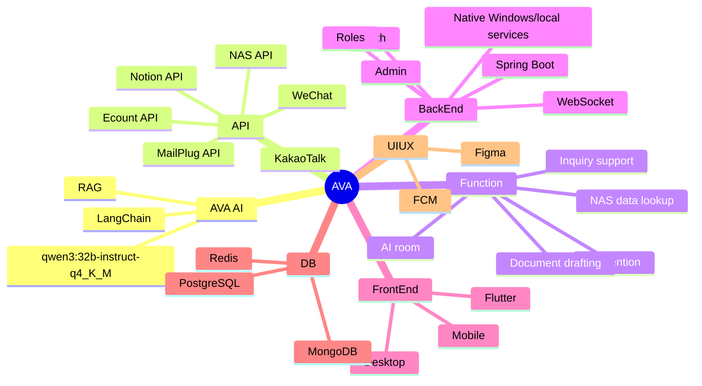

# AVA 설계 마인드맵

## 전체 구조

- **AVA**
  - **AVA AI**
    - qwen3:32b-instruct-q4_K_M
    - RAG
    - LangChain
  - **API**
    - Notion API
    - Ecount API
    - MailPlug API
    - NAS API
    - 카카오톡 연동
    - WeChat 연동
  - **Function**
    - AI 전용방
    - @AI 호출
    - 1:N 질의 응답
    - NAS 데이터 조회/추합
    - 회사 양식 문서 작성
    - 문의 1차 응대
  - **BackEnd**
    - Spring Boot
    - WebSocket
    - Login/Register
    - 로그인 유지
    - 중복 로그인 방지
    - 자동 로그인
    - 암호화
    - 계정 권한
    - ADMIN
    - Native Windows/local services
  - **FrontEnd**
    - Flutter
    - Desktop
    - Mobile
  - **DB**
    - PostgreSQL
      - Main 관계형 DB
    - MongoDB
      - 메시지 아카이브
    - Redis
      - 로그인 세션/캐시
  - **UI/UX**
    - FCM
    - Figma

## Mermaid 마인드맵

